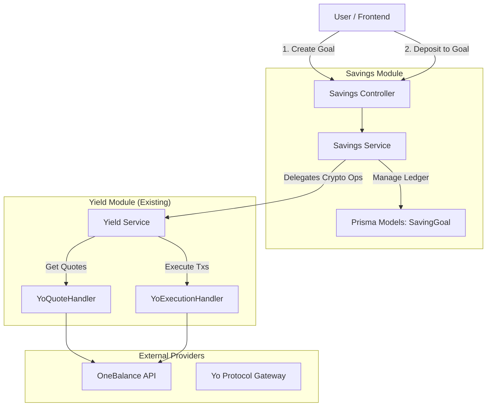

# Anzo Savings Module: System Design & Implementation Plan

> **Status:** Draft
> **Target Module:** `src/modules/savings`
> **Dependencies:** `YieldModule`, `DatabaseModule`, `OneBalance`

## 1. Executive Summary

The **Savings Module** is a robust, goal-oriented savings abstraction layer built on top of the existing **Yield Protocol** (Yo Protocol) and **OneBalance** integration. It allows users to compartmentalize their yield-bearing assets into distinct "goals" (e.g., "Vacation Fund", "Emergency Savings") without fragmenting the underlying on-chain assets.

**Core Principles:**
1.  **Logical Abstraction:** The module acts as an internal ledger. On-chain, the user holds a single balance of `yoUSD` (or other yield tokens). The Savings Module tracks what portion of that balance belongs to which goal.
2.  **Non-Breaking Integration:** It utilizes the existing `YieldModule` for all blockchain interactions (quotes, deposits, redemptions) and essentially "wraps" these operations with additional bookkeeping.
3.  **OneBalance Workflow:** It strictly adheres to the OneBalance V3 3-step execution flow (`quote` -> `call-quote` -> `execute-quote`) to ensure compatibility and security.

---

## 2. System Architecture

The architecture follows a clean layered approach, keeping the new logic decoupled from the complex blockchain integrations handled by `YieldModule`.



### Key Components

1.  **SavingsController (`savings.controller.ts`)**: Exposed REST API for managing goals and initiating goal-based transactions.
2.  **SavingsService (`savings.service.ts`)**: Contains the business logic for:
    *   Goal CRUD operations.
    *   Orchestrating the Deposit/Redemption flow by calling `YieldService`.
    *   Updating the internal ledger (`SavingGoalTransaction`) upon successful on-chain execution.
    *   Calculating projected earnings.
3.  **Database Models**: New tables to track goals and their transactions.

---

## 3. Database Schema Design

We will add two new models to `schema.prisma`. This is an additive change and does not modify existing tables destructively.

```prisma
// src/prisma/schema.prisma

// Represents a specific savings bucket for a user
model SavingGoal {
  id              String    @id @default(cuid())
  userId          String
  yieldTokenId    String    // References YieldToken.id (e.g. yoUSD)
  
  name            String    // Display name: "New Car", "Vacation"
  icon            String?   // Emoji or icon URL
  targetAmount    Decimal?  // Optional financial target
  targetDate      DateTime? // Optional deadline
  
  currentBalance  Decimal   @default(0.0) // Internal ledger balance
  
  status          String    @default("ACTIVE") // ACTIVE, ARCHIVED, COMPLETED
  isDefault       Boolean   @default(false)    // System-created general savings
  
  createdAt       DateTime  @default(now())
  updatedAt       DateTime  @updatedAt

  // Relations
  User                  User                    @relation(fields: [userId], references: [id], onDelete: Cascade)
  YieldToken            YieldToken              @relation(fields: [yieldTokenId], references: [id])
  SavingGoalTransaction SavingGoalTransaction[]

  @@index([userId])
  @@index([status])
}

// Tracks the history of moves into/out of a specific goal
model SavingGoalTransaction {
  id                      String      @id @default(cuid())
  savingGoalId            String
  
  type                    String      // "DEPOSIT" (Cash->Goal) or "WITHDRAWAL" (Goal->Cash)
  amount                  Decimal     // Amount of underlying asset (e.g. USDC)
  
  // Link to the actual on-chain transaction
  underlyingTransactionId String      @unique
  
  createdAt               DateTime    @default(now())
  
  // Relations
  SavingGoal            SavingGoal  @relation(fields: [savingGoalId], references: [id], onDelete: Cascade)
  Transaction           Transaction @relation(fields: [underlyingTransactionId], references: [id])

  @@index([savingGoalId])
}
```

### Relationships
*   `User 1:N SavingGoal`
*   `SavingGoal N:1 YieldToken`: Goals are tied to a specific vault (e.g., yoUSD). This allows multi-currency goals (e.g., a "Bitcoin Stash" backed by `yoBTC`).
*   `SavingGoal 1:N SavingGoalTransaction`
*   `SavingGoalTransaction 1:1 Transaction`: Every ledger entry maps exactly to one proven blockchain transaction.

---

## 4. Workflows & API Endpoints

### 4.1. Goal Management

*   `POST /api/v1/savings`: Create a new goal.
*   `GET /api/v1/savings`: List all goals with balances.
*   `PATCH /api/v1/savings/:id`: Update goal details.
*   `DELETE /api/v1/savings/:id`: Archive a goal (only if balance is 0).

### 4.2. Deposit Flow (Cash -> Savings Goal)

This flow utilizes the **3-step OneBalance signature process**. Although we want a "simplified" UX, security requires the user to sign specific intents.

**Concept**: The user says "Deposit $100 into my Car Fund".
1.  **Quote**: Backend asks OneBalance for a quote to mint $100 worth of yoUSD.
2.  **Sign Intent**: User signs the `chainOperation` (Turnkey/EIP-7702).
3.  **Sign Txs**: User signs the `originChainsOperations` (The actual USDC transfer).
4.  **Execute**: Backend submits txs & updates the `Car Fund` ledger.

**Step 1: Request Deposit Quote**
*   **Endpoint**: `POST /api/v1/savings/:goalId/deposit/quote`
*   **Body**: `{ "amount": "100.00" }`
*   **Logic**:
    1.  Look up `SavingGoal` to get the `vaultSymbol` (e.g., yoUSD).
    2.  Call `YieldService.requestDepositQuote(userId, { vaultSymbol, amount })`.
    3.  Cache the mapping `quoteId -> goalId` (e.g., in Redis or DB) so we know which goal this quote belongs to.
*   **Response**: `{ "quoteId": "...", "chainOperation": { ... } }`

**Step 2: Get Transaction Operations**
*   **Endpoint**: `POST /api/v1/savings/deposit/call-quote`
*   **Body**: `{ "quoteId": "...", "signedChainOperation": "..." }`
*   **Logic**:
    1.  Call `YieldService.callDepositQuote(...)`.
*   **Response**: `{ "originChainsOperations": [ ... ], "obQuoteId": "..." }`

**Step 3: Execute & Ledger Update**
*   **Endpoint**: `POST /api/v1/savings/deposit/execute`
*   **Body**: `{ "quoteId": "...", "signedOriginOperations": [ ... ] }`
*   **Logic**:
    1.  Retrieve the `goalId` associated with this `quoteId` (from cache/metadata).
    2.  Call `YieldService.executeDeposit(...)`. This returns a `transactionId`.
    3.  **CRITICAL**: Create a `SavingGoalTransaction` record linking the `goalId` and `transactionId`.
    4.  Update `SavingGoal.currentBalance += amount`.
*   **Response**: `{ "success": true, "transactionId": "...", "newBalance": "..." }`

### 4.3. Redemption Flow (Savings Goal -> Cash)

Similar to deposit, but reduces the goal balance.

*   `POST /api/v1/savings/:goalId/withdraw/quote`
*   `POST /api/v1/savings/withdraw/call-quote`
*   `POST /api/v1/savings/withdraw/execute`
    *   **Logic**: Decrement `SavingGoal.currentBalance`.
    *   **Validation**: Ensure `withdrawalAmount <= SavingGoal.currentBalance`.

### 4.4. Balance Reconciliation (Background Job)

Since users earn yield continuously (rebasing or share value increase), the sum of their "static" goal balances will eventually be *less* than their actual on-chain yoUSD value.

**Strategy**: "Unassigned Interest"
*   **On-Chain Truth**: Fetch actual `yoUSD` balance via `YieldPositionsService`.
*   **Ledger Truth**: Sum of all `SavingGoal.currentBalance`.
*   **Difference**: `Actual - Ledger = Unassigned Yield`.
*   **Action**: Automatically credit this difference to the user's **Default** savings goal (System created).

**Job Frequency**: Daily.
**Logic**:
1.  Get `totalShares` from OneBalance/Covalent.
2.  Get `sharePrice` from Yo Protocol.
3.  `RealBalance = totalShares * sharePrice`.
4.  `LedgerBalance = Sum(GoalBalances)`.
5.  `Diff = RealBalance - LedgerBalance`.
6.  If `Diff > 0`: Update Default Goal `currentBalance += Diff`.

---

## 5. Implementation Steps

### Phase 1: Database & Models (Immediate)
1.  Update `prisma/schema.prisma` with `SavingGoal` and `SavingGoalTransaction`.
2.  Run migration: `npx prisma migrate dev --name add_savings_module`.
3.  Generate client: `npx prisma generate`.

### Phase 2: Savings Module Core
1.  Create `src/modules/savings/savings.module.ts`.
2.  Create `src/modules/savings/savings.controller.ts`.
3.  Create `src/modules/savings/savings.service.ts`.
4.  Implement basic CRUD for goals.

### Phase 3: Integration with Yield Module
1.  Inject `YieldService` into `SavingsService`.
2.  Implement the Wrapper Endpoints (Quote -> Call -> Execute).
3.  Add logic to intercept the `execute` success and write to the internal ledger `SavingGoalTransaction`.

### Phase 4: Reconciliation & Testing
1.  Implement the `getTotalSavingsBalance` method.
2.  Write unit tests for the ledger logic (ensuring we don't double count).
3.  Verify flows with Postman against the OneBalance Testnet/Mainnet.

---

## 6. Security Considerations

*   **Ledger Integrity**: All updates to `SavingGoal.currentBalance` MUST occur inside a Prisma Transaction (`$transaction`) alongside the creation of the `SavingGoalTransaction` record.
*   **Ownership Check**: Middleware must strictly verify that the `goalId` belongs to the authenticated `req.user.userId`.
*   **Negative Balances**: DB constraints or application logic must prevent a goal balance from going below zero.

---

## 7. Sample Code Structure

### `savings.service.ts` Skeleton

```typescript
@Injectable()
export class SavingsService {
  constructor(
    private prisma: PrismaService,
    private yieldService: YieldService
  ) {}

  async requestDepositQuote(userId: string, goalId: string, amount: string) {
    // 1. Validate Goal
    const goal = await this.prisma.savingGoal.findFirst({
        where: { id: goalId, userId },
        include: { YieldToken: true }
    });
    if (!goal) throw new NotFoundException('Goal not found');

    // 2. Call Yield Service
    const quote = await this.yieldService.requestDepositQuote(userId, {
        vaultSymbol: goal.YieldToken.symbol,
        amount: amount
    });
    
    // 3. Store Goal Context (e.g. in Metadata of the quote if supported, or cache)
    // For this MVP, we can rely on the user passing the goalId again in the execute step
    // OR allow the execute wrappers to accept goalId.
    
    return quote;
  }

  async executeDeposit(userId: string, goalId: string, dto: YieldDepositExecuteDto) {
     return this.prisma.$transaction(async (tx) => {
        // 1. Execute On-Chain
        // Note: We might need to handle this carefully if yieldService.execute is not transaction-aware
        // Ideally, we execute yield first. If it fails, we abort.
        const result = await this.yieldService.executeDeposit(userId, dto);
        
        // 2. Update Ledger
        await tx.savingGoal.update({
            where: { id: goalId },
            data: { currentBalance: { increment: dto.amount } } // Need to parse amount
        });

        // 3. Record Transaction
        await tx.savingGoalTransaction.create({
            data: {
                savingGoalId: goalId,
                type: 'DEPOSIT',
                amount: dto.amount, // Need to ensure we have the amount here or from result
                underlyingTransactionId: result.transactionId
            }
        });
        
        return result;
     });
  }
}
```
