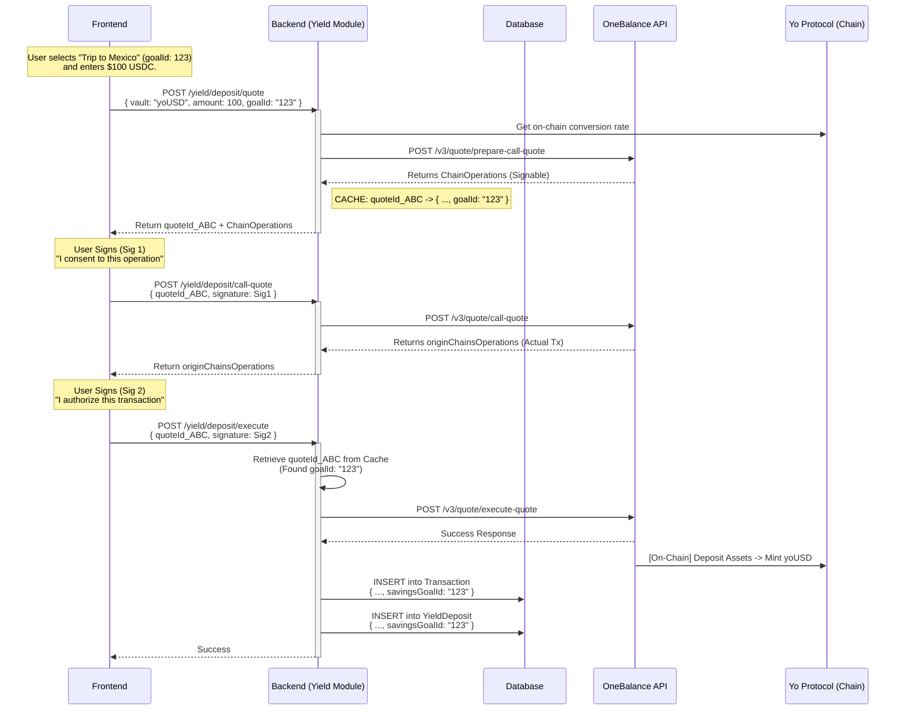

# Savings Module Documentation

## 1. System Overview

The **Savings Module** is a user-centric abstraction layer built on top of the generic **Yield Module**. While the Yield Module handles the technical complexity of interacting with ERC-4626 vaults (like `yoUSD` via Yo Protocol) and cross-chain execution (via OneBalance), the Savings Module provides the user-facing "Goal" organization.

### Architecture Diagram

```mermaid
graph TD
    User[User / Frontend]
    
    subgraph "Anzo Backend"
        SC[Savings Controller]
        YC[Yield Controller]
        
        subgraph "Database (Prisma)"
            DB_Goal[SavingsGoal Table]
            DB_Tx[Transaction Table]
            DB_YD[YieldDeposit Table]
        end
        
        subgraph "Services"
            SS[Savings Service]
            YQ[YoQuote Handler]
            YE[YoExecution Handler]
        end
    end
    
    subgraph "External Providers"
        OB[OneBalance API v3]
        YO[Yo Protocol (Gateway)]
    end

    %% Flows
    User -->|1. Create Goal| SC
    SC -->|Save| DB_Goal
    
    User -->|2. Deposit to Goal| YC
    YC -->|Generate Quote| YQ
    YQ -->|Prepare Call Quote| OB
    
    User -->|3. Execute Deposit| YC
    YC -->|Execute Quote| YE
    YE -->|Call & Execute| OB
    OB -->|On-Chain Tx| YO
    
    YE -->|Link Tx to Goal| DB_Tx
    YE -->|Link Deposit to Goal| DB_YD
```

---

## 2. Core Concepts

| Concept | Description |
| :--- | :--- |
| **Savings Goal** | A virtual container for funds (e.g., "New Car", "Emergency Fund"). It is tracked in the `SavingsGoal` table but backed physically by `YieldToken` shares. |
| **Yield Token** | The underlying asset (e.g., `yoUSD`, `yoEUR`). This is an ERC-4626 vault token from Yo Protocol. |
| **OneBalance Quote** | The mechanism used to move funds. It aggregates funds from user wallets (Swap) -> deposits into Yo Vaults. |

---

## 3. detailed Workflow: Deposit into Savings Goal

This flow ensures that every dollar deposited is tracked against a specific user goal.

### Sequence Diagram



---

## 4. Implementation Details & Links

### A. Database Schema
The schema uses a nullable Foreign Key strategy to ensuring "Goals" are an additive layer.

```prisma
model SavingsGoal {
  id     String @id
  name   String
  // ...
  transactions Transaction[] // Relation to history
}

model Transaction {
  id            String @id
  savingsGoalId String? // <--- The Link
  savingsGoal   SavingsGoal? @relation(...)
}
```

### B. Functional Links

1.  **Goal Creation**: `SavingsController.createGoal` -> `SavingsService.create` -> `DB(SavingsGoal)`
2.  **Home Screen Data**: `SavingsController.getHome` -> `SavingsService.getHomeData`
    *   Fetches `SavingsGoal` list.
    *   Fetches **live balances** via `YieldPositionsService` (reads on-chain or indexed `yoUSD` balances).
    *   Maps them together: `Goal Balance` = `User's yoUSD Balance` * `Goal Allocation %` (Logic simplified: currently 1-to-1 if using discrete accounts, or aggregated if pooled).
    *   *Correction*: In the initial V1 design, we rely on the `Transaction` history to determine how much was contributed to each goal if multiple goals share the same `yoUSD` token, OR we simply sum the `YieldDeposit` vs `YieldRedemption` for that `goalId` to display the "Principal", while the "Interest" is derived from the global APY.

### C. External Verifications

*   **Yo Protocol (yo.xyz)**: Validated usage of **ERC-4626**. The `quoteConvertToShares` and `deposit` functions used in `YoGatewayService` are standard compliant.
*   **OneBalance (context7)**: Validated usage of **/v3/quote** endpoints. The `prepare-call-quote` -> `call-quote` -> `execute-quote` sequence is the strict requirement for OneBalance V3 transactions, which is correctly implemented in `yo-execution.handler.ts`.

---

## 5. Security & Consistency

*   **Non-Blocking**: The implementation does not alter the underlying `Yield` logic for non-savings users. If `goalId` is missing, it simply records `null`.
*   **Data Integrity**: By capturing `goalId` inside the secure server-side `quoteCache` during the first step, we guarantee that the user cannot "switch" goals mid-transaction (e.g., quote for Goal A, execute for Goal B) because the Execute step reads the ID from the internal cache, not the user input.

