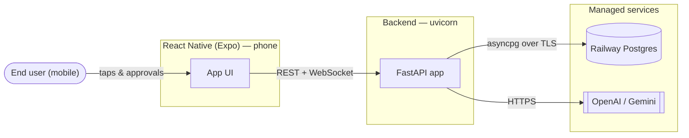
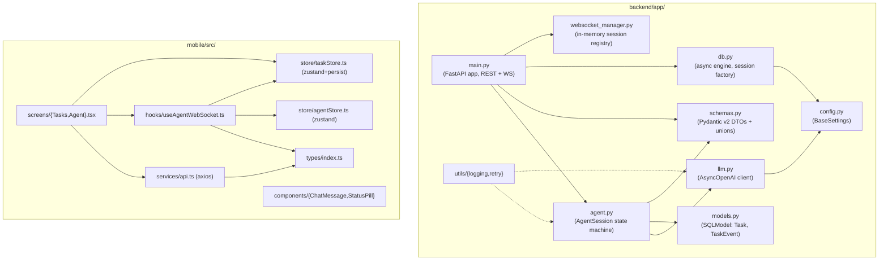
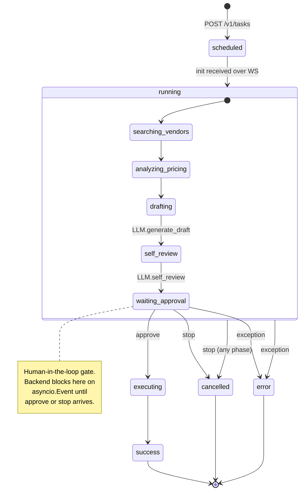
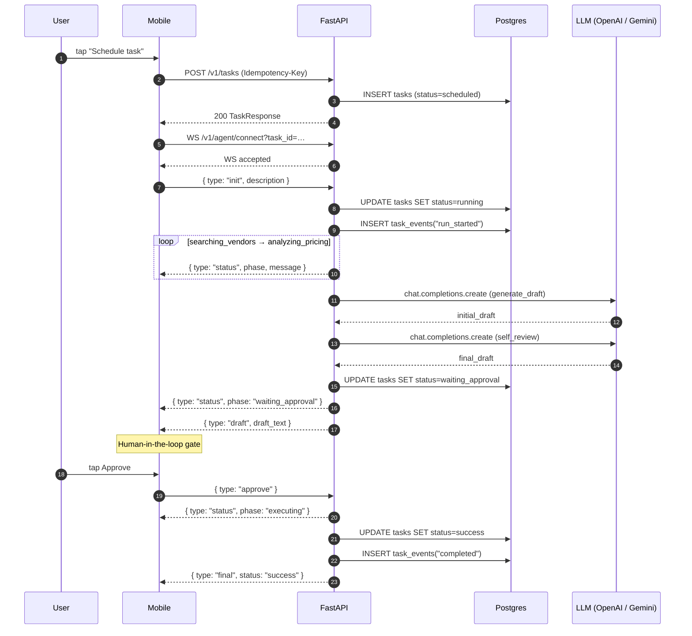
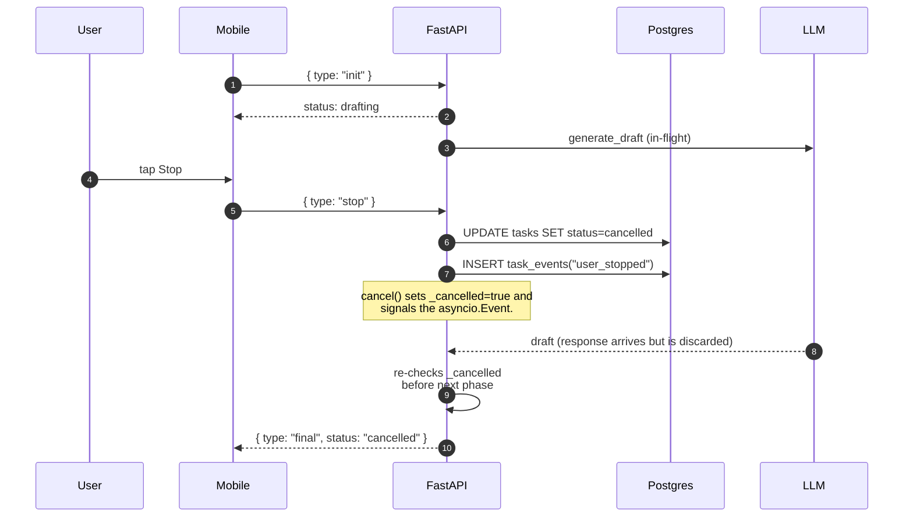
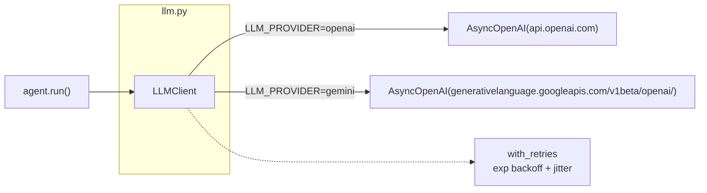
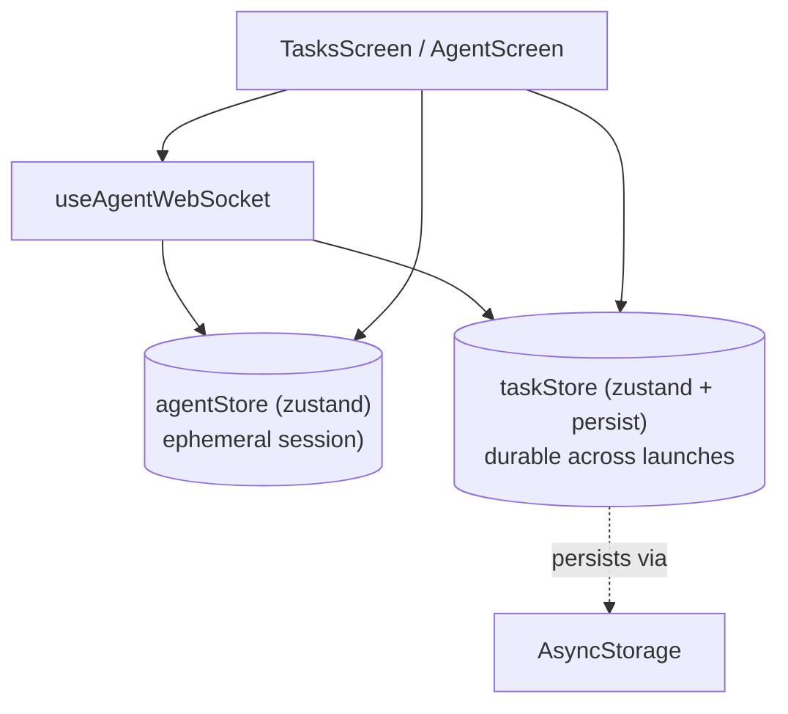
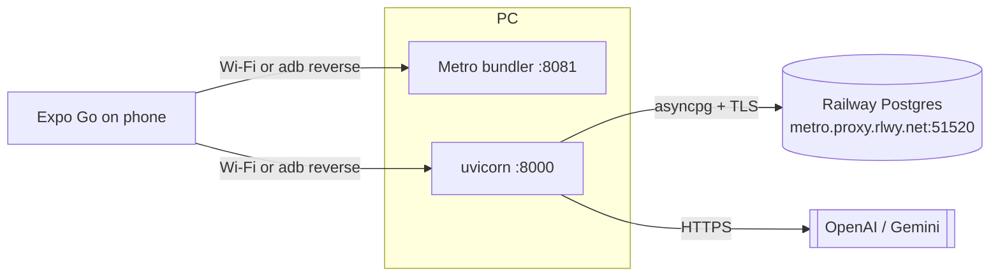
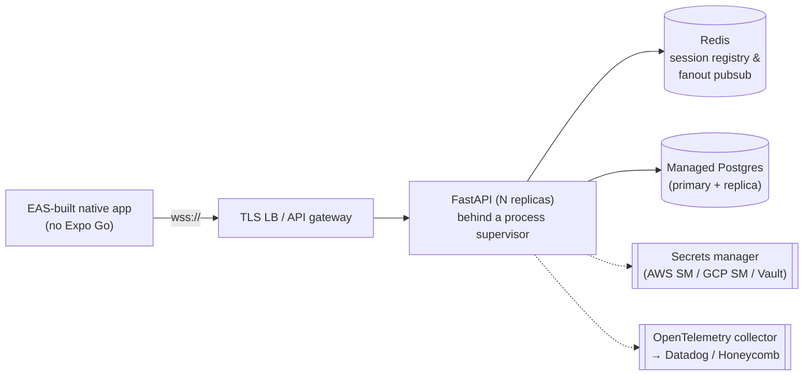
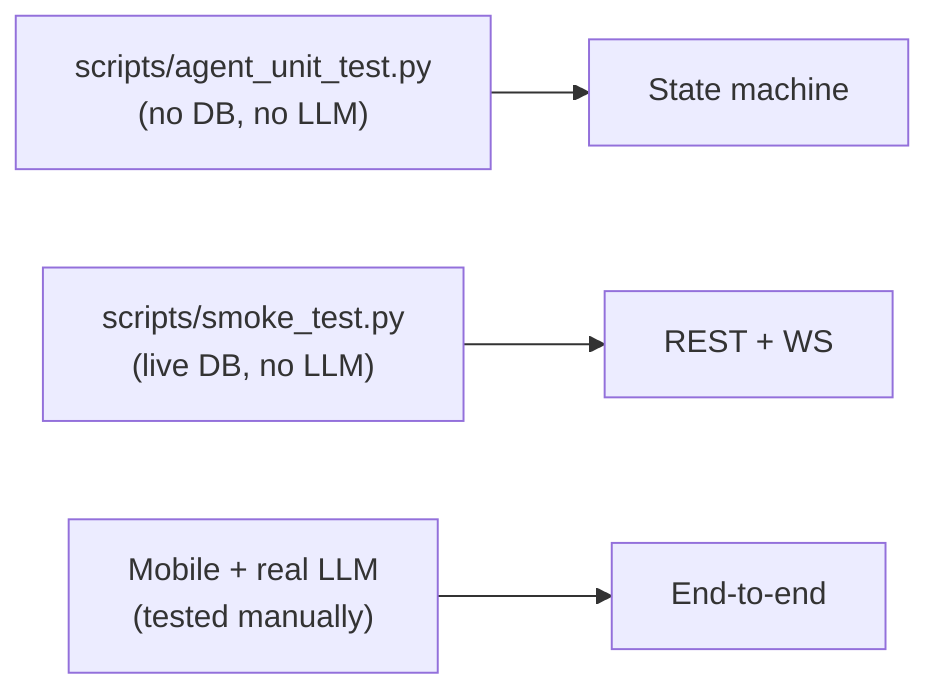

# Architecture — TryAngle42 Agentic Communication Bridge

A reference architecture document for engineers reviewing or extending this
codebase. It describes the system, the data model, the agent state machine,
the wire protocols, the concurrency model, and the deployment topology.

> All diagrams are written in [Mermaid](https://mermaid.js.org/) and render
> natively on GitHub.

---

## Table of contents

1. [System context](#1-system-context)
2. [Component architecture](#2-component-architecture)
3. [Data model](#3-data-model)
4. [Agent state machine](#4-agent-state-machine)
5. [WebSocket protocol](#5-websocket-protocol)
6. [Sequence flows](#6-sequence-flows)
7. [Concurrency & race-safety model](#7-concurrency--race-safety-model)
8. [Persistence semantics & idempotency](#8-persistence-semantics--idempotency)
9. [LLM provider abstraction](#9-llm-provider-abstraction)
10. [Mobile state management](#10-mobile-state-management)
11. [Deployment topology](#11-deployment-topology)
12. [Security model](#12-security-model)
13. [Observability](#13-observability)
14. [Testing strategy](#14-testing-strategy)
15. [Tradeoffs & future work](#15-tradeoffs--future-work)

---

## 1. System context



The system has three actors:

- **End user** drives the mobile UI to schedule and supervise outreach tasks.
- **Mobile client** is an Expo + React Native + TypeScript app that streams
  agent updates and gates execution behind explicit user approval.
- **Backend** is a FastAPI service that runs the agent state machine,
  persists task lifecycle in Postgres, and brokers calls to the LLM.

Two managed external services:

- **Railway Postgres** — the only durable store.
- **OpenAI / Gemini** — selected at runtime via `LLM_PROVIDER`.

---

## 2. Component architecture



**Why this split?**

- `main.py` is intentionally thin — it owns HTTP/WS surface, validation, and
  dependency injection. All business logic lives in `agent.py`.
- `AgentSession` encapsulates one task's lifecycle. It is the only object that
  mutates `task.status` after creation, which keeps the invariants local.
- `LLMClient` is a single seam for both OpenAI and Gemini, so swapping
  providers is a one-branch change.
- The mobile app cleanly separates **persistent state** (`taskStore`, with
  AsyncStorage) from **ephemeral session state** (`agentStore`).

---

## 3. Data model

Two tables. The schema is intentionally minimal but production-shaped: every
state transition is auditable via `task_events`.

```mermaid
erDiagram
    TASKS ||--o{ TASK_EVENTS : "1 task → many events"

    TASKS {
        uuid       id PK
        timestamptz created_at
        timestamptz updated_at
        text        description
        text        status        "scheduled|running|waiting_approval|success|cancelled|error"
        text        idempotency_key  UK
        text        last_error    nullable
    }

    TASK_EVENTS {
        bigserial   id PK
        uuid        task_id FK
        timestamptz created_at
        text        event_type
        jsonb       payload       nullable
    }
```

Indexes:

- `tasks.id` (PK)
- `tasks.idempotency_key` (unique, partial — only one row per supplied key)
- `task_events.task_id` (lookups by task)
- `task_events.(task_id, created_at)` (timeline queries)

`task_events` examples emitted by the agent:

| event_type | payload (JSON)                                | when                                |
| ---------- | --------------------------------------------- | ----------------------------------- |
| `run_started`     | `{ "description_preview": "..." }`     | task moves `scheduled → running`    |
| `status_update`   | `{ "phase": "drafting", "message": "..." }` | each phase transition          |
| `draft_generated` | `{ "draft_preview": "..." }`           | after self-review                   |
| `user_approved`   | `{}`                                   | when client sends `approve`         |
| `user_stopped`    | `{}`                                   | when client sends `stop`            |
| `completed`       | `{}`                                   | task reaches `success`              |
| `error`           | `{ "error": "..." }`                   | exception escapes the run loop      |

> The events table is append-only. We never `UPDATE` or `DELETE` rows there,
> so it doubles as a tamper-evident audit trail.

---

## 4. Agent state machine

The agent runs through a strictly ordered sequence of phases. The state
machine has **three terminal states**: `success`, `cancelled`, `error`.



Mapping between **internal `AgentPhase`** and the **wire phase string** sent
to the client:

| Internal `AgentPhase` | Wire `phase` |
| --------------------- | -------------- |
| `searching_vendors` … `executing` | identical |
| `completed`          | `success`      |
| `cancelled`          | `cancelled`    |
| `error`              | `error`        |

This split exists because the internal value `completed` is more accurate
inside the run loop, while the client prefers the user-facing `success`.

---

## 5. WebSocket protocol

A single bidirectional channel: `ws://<host>/v1/agent/connect?task_id=<uuid>`.

### 5.1 Client → server

All messages are validated against a Pydantic v2 discriminated union
(`AgentClientMessage`):

```jsonc
{ "type": "init",    "task_id": "<uuid>", "description": "..." }
{ "type": "approve", "task_id": "<uuid>" }
{ "type": "stop",    "task_id": "<uuid>" }
```

- `init` is idempotent at the session level — sending it twice on the same
  connection is logged and ignored.
- `approve` only fires the gate when the agent is in `waiting_approval`.
- `stop` is honored at any time; arriving after a terminal state only logs
  an audit event.

### 5.2 Server → client

```jsonc
// Phase update (emitted at every transition)
{ "type": "status", "task_id": "<uuid>", "phase": "drafting",
  "message": "Drafting outreach message...", "ts": "2026-04-27T12:48:25Z" }

// One-shot draft delivery (after self_review)
{ "type": "draft",  "task_id": "<uuid>",
  "draft_text": "Hi, ...",  "ts": "..." }

// Terminal message
{ "type": "final",  "task_id": "<uuid>",
  "status": "success" | "cancelled" | "error",
  "message": "...", "ts": "..." }
```

The client renders `status` messages as transient progress, `draft` messages
as the approval target, and `final` messages as the run terminator.

---

## 6. Sequence flows

### 6.1 Happy path: schedule → approve → success



### 6.2 Stop before approval



### 6.3 Race: APPROVE and STOP fire simultaneously

```mermaid
sequenceDiagram
    autonumber
    participant U as User
    participant M as Mobile
    participant API as FastAPI

    Note over API: phase = waiting_approval
    par approve race
      M->>API: { type: "approve" }
    and stop race
      M->>API: { type: "stop" }
    end
    Note over API: Both contend for asyncio.Lock.<br/>cancel() always sets _cancelled=true,<br/>even if approve() ran first.
    API->>API: gate releases; loop re-checks<br/>_cancelled UNDER the lock
    API-->>M: { type: "final", status: "cancelled" }
```

The deterministic outcome of this race is **cancelled**. STOP wins ties — the
safer default for a human-in-the-loop system. Verified by
`scripts/agent_unit_test.py::test_race_approve_and_stop` (8/8 cancelled, with
wire status and DB status always consistent).

---

## 7. Concurrency & race-safety model

The run loop, approve, and cancel coroutines all share one `AgentSession`
instance. The session is protected by:

- An **`asyncio.Lock`** that guards every mutation of `_approved`,
  `_cancelled`, and `task.status`.
- An **`asyncio.Event`** that acts as the consent gate (instead of a
  busy-wait poll loop), so STOP / APPROVE wake the run loop instantly.

The contract that makes the race safe:

1. **`cancel()` always wins ties.** It unconditionally flips `_cancelled` and
   sets the event, regardless of whether `_approved` was already set.
2. **The run loop re-checks `_cancelled` under the lock** at every phase
   transition — including immediately before writing `success`. If a STOP
   arrives during the simulated `executing` step, it is honored.
3. **A late STOP after `success` is non-destructive.** `cancel()` sees the
   terminal status and only writes an audit event; it never overwrites
   `success` or `error`.
4. **Wire and DB always agree.** The `final` WebSocket message and the row's
   `status` column are written under the same lock, so a client cannot
   observe `success` over the wire while the DB says `cancelled`.

```mermaid
sequenceDiagram
    participant Run as run() loop
    participant Lock as asyncio.Lock
    participant Cancel as cancel()
    participant Approve as approve()
    participant Event as asyncio.Event

    Run->>Lock: acquire
    Run->>Run: write status=waiting_approval
    Lock-->>Run: release
    Run->>Event: await wait()

    par
      Approve->>Lock: acquire
      Approve->>Approve: _approved=true
      Lock-->>Approve: release
      Approve->>Event: set()
    and
      Cancel->>Lock: acquire
      Cancel->>Cancel: _cancelled=true; status=cancelled
      Lock-->>Cancel: release
      Cancel->>Event: set()
    end

    Event-->>Run: woken
    Run->>Lock: acquire
    Run->>Run: re-check _cancelled
    alt _cancelled
      Run->>Run: emit final("cancelled")
    else
      Run->>Run: do executing; re-check _cancelled
      Run->>Run: emit final("success") or ("cancelled")
    end
    Lock-->>Run: release
```

---

## 8. Persistence semantics & idempotency

### 8.1 Idempotency key

`POST /v1/tasks` accepts an optional `Idempotency-Key` header. The unique
index `tasks.idempotency_key` enforces at-most-once semantics. If a request
arrives with a key that already exists, the **original task is returned** and
no new row is created. The mobile client generates one nanoid per "Schedule"
tap and retries with the same key on transient failure (current
implementation issues a single attempt; the contract is in place for retry).

### 8.2 Session lifecycle (request vs. WebSocket)

There are two distinct DB session lifecycles:

- **REST handlers** use `Depends(get_session)`, which is request-scoped.
- **WebSocket handler** opens its own `async_session_maker()` for the entire
  socket lifetime, because the agent run can outlive any single inbound
  message and we need a stable session for `commit()`s issued from inside
  the agent.

The WebSocket handler also waits up to **5 seconds** on disconnect for the
agent run to finalize, so `task.status` always converges to a terminal state
even if the client closes mid-run.

### 8.3 Transactional discipline

Each state transition writes both a status update on `tasks` and an event
row in `task_events`, committed in two separate transactions. We deliberately
do not bundle them into one transaction:

- The status write must be visible to other readers as quickly as possible
  (a polling client may want the new status).
- The audit log is append-only and tolerates eventual consistency relative
  to the canonical row.

If both writes failed, the run-loop's exception handler would mark the task
as `error` and persist a corresponding event, so the row never gets stuck.

---

## 9. LLM provider abstraction



Both providers are accessed through the same `openai.AsyncOpenAI` client,
because Google exposes Gemini behind an OpenAI-compatible chat completions
endpoint. This means:

- One code path, one set of error handlers.
- Adding Anthropic via OpenRouter or Azure OpenAI is a one-branch change.
- The retry helper (`utils/retry.py`) wraps every chat call with three
  exponential-backoff attempts and randomized jitter.

---

## 10. Mobile state management



**Two stores by design:**

- `taskStore` — the durable list of tasks the user has scheduled. Persisted
  with `zustand/middleware`'s `persist` over `AsyncStorage` so the list (and
  the last-selected task) survive app restarts.
- `agentStore` — chat transcript, current phase, draft text, approval flag.
  Wiped via `reset()` on every Agent screen focus, because each task open
  starts a fresh agent session and a fresh transcript.

**WebSocket lifecycle** is fully encapsulated in `useAgentWebSocket(taskId, description)`:

- Opens the socket on mount, sends `init` immediately on `onopen`.
- Routes incoming `status` / `draft` / `final` messages into the agent store.
- Closes the socket on unmount **and** on `AppState !== 'active'` (background)
  to avoid leaking sockets on Android.
- Exposes `sendApprove()`, `sendStop()`, and `disconnect()` to the screen.

---

## 11. Deployment topology

### 11.1 Local development



Two reachability options on Windows:

- **Wi-Fi**: phone and PC on the same network → set
  `EXPO_PUBLIC_BACKEND_HTTP_URL=http://<PC LAN IP>:8000`. Verify with
  `http://<PC LAN IP>:8000/health` from the phone's browser. Add a Windows
  Firewall inbound rule for port 8000 (Private profile) if it's blocked.
- **USB / adb reverse**: keep `localhost`, then run
  `adb reverse tcp:8000 tcp:8000` (and `tcp:8081` for Metro).

### 11.2 Production-grade topology (out of scope; recommended path)



Key changes for production:

- The current **in-memory** `_sessions` registry in `websocket_manager.py`
  must be replaced by a Redis-backed registry **plus** a pub/sub channel, so
  any backend replica can deliver an APPROVE/STOP to the replica that owns
  the WebSocket. (Currently it is correct only on a single-process backend.)
- Secrets move out of `.env` into a managed secret store, injected at
  process start.
- TLS terminates at the LB; the backend listens HTTP-only inside the VPC.
- Schema changes managed by Alembic migrations, not `SQLModel.metadata.create_all`.
- Add structured logging + traces via OpenTelemetry, dashboards in
  Grafana / Datadog.

---

## 12. Security model

| Layer | Practice in this prototype | Production hardening |
| ----- | -------------------------- | --------------------- |
| **Secrets** | `.env` files, gitignored; `.env.example` committed with placeholders | Move to AWS Secrets Manager / GCP Secret Manager; rotate quarterly |
| **Transport (mobile ↔ backend)** | Plain HTTP over LAN | TLS 1.3 (`https://` + `wss://`) terminated at API gateway |
| **Transport (backend ↔ DB)** | TLS to Railway proxy with `sslmode=require` semantics; verification disabled by default for Railway's self-signed chain (set `DATABASE_SSL=verify` to enforce) | Use a managed Postgres with a public CA cert, set `DATABASE_SSL=verify` |
| **Authentication** | None (single-tenant prototype) | OAuth2 / OIDC; per-user tasks |
| **Authorization** | None | Row-level: `tasks.owner_id` + RLS or filter at query time |
| **CORS** | `*` for dev | Allowlist of mobile/web origins |
| **Input validation** | Pydantic v2 on every REST and WS payload; discriminated unions reject unknown `type` | Same |
| **Rate limiting** | None | Token bucket per IP / per user at the LB or via `slowapi` |
| **WS auth** | task_id only | Bearer JWT on the WebSocket handshake; backend validates `task.owner_id == jwt.sub` |

---

## 13. Observability

The prototype uses Python's stdlib `logging` configured by `utils/logging.py`,
emitting structured single-line records:

```
2026-04-27T12:48:05 | INFO | app.llm | LLMClient initialized: provider=LLMProvider.openai model=gpt-4.1-mini
```

Suggested production additions:

- **Structured JSON logs** (e.g. `python-json-logger`) for ingestion by
  Datadog / Loki / OpenSearch.
- **OpenTelemetry tracing** around `AgentSession.run()` so each phase
  becomes a span; correlate via `task_id`.
- **RED metrics** (Rate, Errors, Duration) for every REST endpoint and a
  custom counter per `AgentPhase` transition.

---

## 14. Testing strategy



Layered, fast-first:

| Layer | What it covers | Runtime |
| ----- | -------------- | ------- |
| `agent_unit_test.py` | Approve, stop-before-draft, stop-during-waiting, no-overwrite-after-success, **8× simultaneous race** | < 5 s |
| `smoke_test.py`      | Idempotent POST, list, get, WebSocket STOP flow, DB persistence | ~ 25 s (live Postgres) |
| Manual mobile drive  | OpenAI / Gemini draft + self-review + approve + execute + cancel | minutes |

The race test is the most important: it asserts that the wire `final.status`
and the DB `task.status` **always agree**, no matter the interleaving of
APPROVE and STOP.

---

## 15. Tradeoffs & future work

Conscious omissions (with the path to fix):

- **No multi-replica WebSocket fanout.** The session registry is in-process.
  Solution: Redis hash + pub/sub keyed by `task_id`.
- **`SQLModel.metadata.create_all` instead of migrations.** Acceptable for a
  prototype; add Alembic when the schema evolves with users.
- **Expo Go** for delivery. Acceptable for demo; real deployments should use
  EAS development/production builds (`eas build`).
- **No auth.** Add OIDC + per-user `tasks.owner_id` + RLS in Postgres.
- **The "executing" step is simulated** (`asyncio.sleep(0.5)`). In a real
  deployment this is where you'd plug in the outbound integration — SMTP,
  WhatsApp Cloud API, Twilio, etc., wrapped in `with_retries` and
  idempotent at the provider level.
- **No back-pressure on LLM calls.** A bursty mobile client could create
  many sessions in parallel. Solution: a per-user concurrency limiter
  using `asyncio.Semaphore` or a queue + worker pool.
- **No PII redaction in `task_events.payload`.** The current `draft_preview`
  truncates at 300 chars; for production add structured redaction before
  persisting.

---

## Appendix A — Repository layout

```
.
├── ARCHITECTURE.md              ← this document
├── README.md                    ← setup, env vars, endpoints, quickstart
├── LICENSE                      ← MIT
├── .gitignore, .gitattributes   ← prod-grade ignore set + LF normalization
│
├── backend/
│   ├── app/
│   │   ├── main.py              ← FastAPI app, REST + /v1/agent/connect
│   │   ├── agent.py             ← AgentSession state machine
│   │   ├── websocket_manager.py ← in-memory session registry
│   │   ├── llm.py               ← AsyncOpenAI client (OpenAI / Gemini)
│   │   ├── db.py                ← async engine, sync→async URL rewrite, SSL
│   │   ├── models.py            ← SQLModel: Task, TaskEvent + indexes
│   │   ├── schemas.py           ← Pydantic v2 DTOs + discriminated unions
│   │   ├── config.py            ← BaseSettings, .env loader, LLMProvider
│   │   └── utils/               ← logging.py, retry.py
│   ├── scripts/
│   │   ├── bootstrap_db.py      ← create the target DB on Railway (one-shot)
│   │   ├── agent_unit_test.py   ← race-safety + state-machine tests
│   │   └── smoke_test.py        ← live REST + WS end-to-end test
│   ├── requirements.txt, pyproject.toml
│   └── .env.example             ← committed; .env is ignored
│
└── mobile/
    ├── App.tsx                  ← navigation root
    ├── index.js                 ← Expo registerRootComponent entry
    ├── app.json, babel.config.js, tsconfig.json
    ├── package.json, package-lock.json
    ├── .eslintrc.js, .prettierrc
    └── src/
        ├── store/               ← taskStore (persisted), agentStore (ephemeral)
        ├── hooks/               ← useAgentWebSocket
        ├── services/api.ts      ← axios + Idempotency-Key header
        ├── components/          ← ChatMessage, StatusPill
        ├── screens/             ← TasksScreen, AgentScreen, navigationTypes
        └── types/index.ts       ← REST + WS type set
```

---

## Appendix B — Key environment variables

| Variable | Where | Purpose |
| -------- | ----- | ------- |
| `DATABASE_URL` | `backend/.env` | Sync-style Postgres URL; backend rewrites to `postgresql+asyncpg://` |
| `DATABASE_SSL` | `backend/.env` | `require` (default, encrypts but skips verify) or `verify` (full chain check) |
| `LLM_PROVIDER` | `backend/.env` | `openai` or `gemini` |
| `OPENAI_API_KEY`, `OPENAI_BASE_URL` | `backend/.env` | OpenAI credentials & optional base URL override |
| `GEMINI_API_KEY`, `GEMINI_BASE_URL` | `backend/.env` | Gemini credentials & OpenAI-compatible endpoint |
| `DEFAULT_MODEL`, `GEMINI_MODEL` | `backend/.env` | Model names per provider |
| `EXPO_PUBLIC_BACKEND_HTTP_URL` | `mobile/.env` | Axios baseURL — must include scheme and port |
| `EXPO_PUBLIC_BACKEND_WS_URL` | `mobile/.env` | WebSocket base — `ws://` for dev, `wss://` for prod |

> Note: `EXPO_PUBLIC_*` values are inlined into the bundle at build time.
> Restart Metro with `--clear` after any change.
