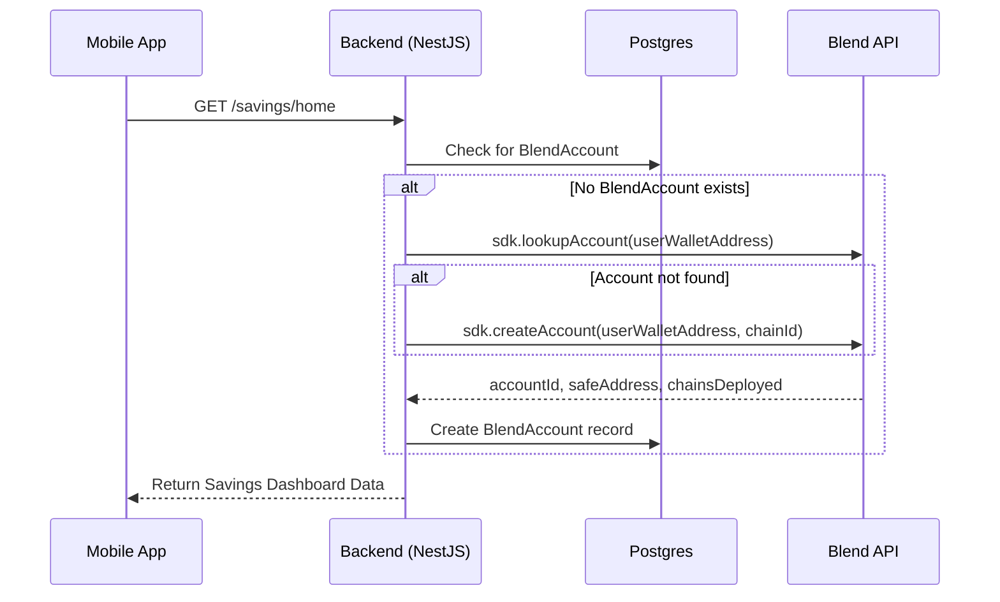
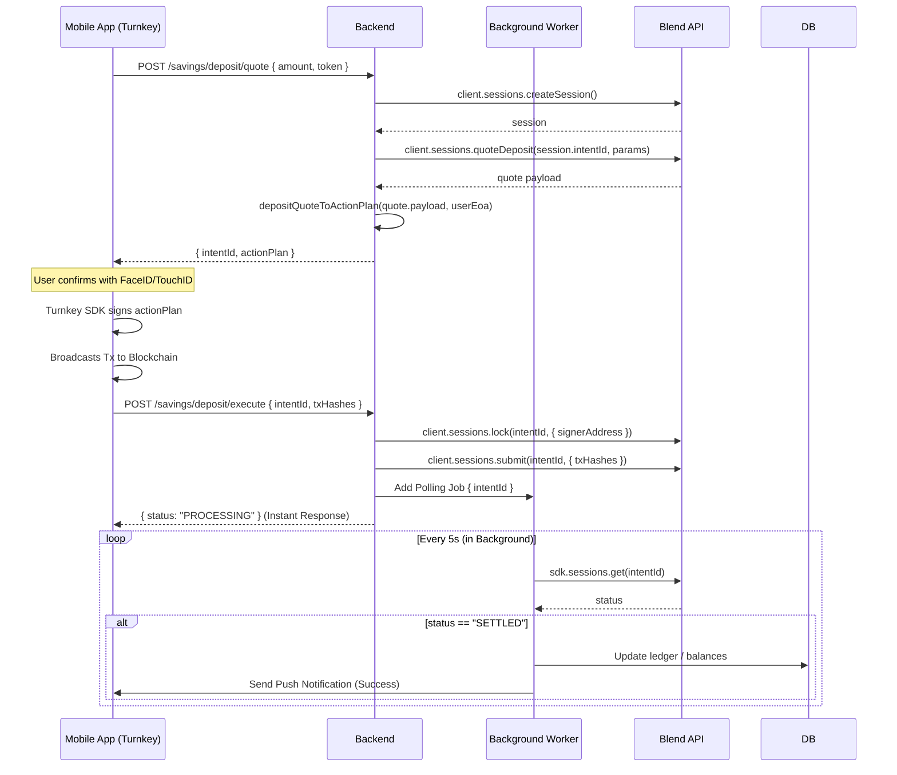

# Blend Server SDK Integration Architecture

**Project:** Avvio (Backend)
**Status:** Architecture Design & Implementation Plan
**Date:** May 14, 2026

---

## 1. Executive Summary

This document outlines the architecture for integrating the **Blend Server SDK** (`@blend-money/node`) into the Avvio backend. Blend provides non-custodial, cross-chain yield infrastructure using individual Gnosis Safes. 

By replacing the legacy yield module with Blend, we are upgrading to a significantly more secure, auditable, and scalable non-custodial model. Crucially, the server will handle the complex orchestration of sessions and action plans, but **the user's keys on the mobile device will retain exclusive signing authority** via Turnkey.

## 2. Core Architectural Principles

1. **Strict Non-Custodial Security:** The backend uses an administrative `BLEND_API_KEY` to orchestrate sessions, fetch quotes, and poll for settlement. However, the backend **never** holds signing power for user funds. All transaction payloads (`ActionPlans`) are forwarded to the mobile app, where the user signs natively via `@turnkey/react-native-wallet-kit` (FaceID/TouchID).
2. **Asynchronous Execution:** Blockchain settlement is decoupled from HTTP requests. Once the mobile app submits signed transaction hashes, the backend immediately responds with a success status and offloads polling to a background worker queue (e.g., BullMQ).
3. **Phased Rollout:** The legacy YO Protocol integration will be phased out systematically. Blend will be launched as the new primary "Savings" product, followed by a guided migration for existing users, and finally the sunsetting of the legacy modules.

---

## 3. Environment Variables

The implementation requires the following additions to `.env`:

```ini
# ============================================
# NEW: Blend.money Integration (Required)
# ============================================

# The administrative API key from the Blend Portal (Server-side only)
BLEND_API_KEY=sk_live_...

# The specific account type slug for this deployment
BLEND_ACCOUNT_TYPE_ID=savings

# The base URL for the Blend API (Allows overriding for staging environments)
BLEND_API_URL=https://api.portal.blend.money

# Required for gas-sponsorship on Blend withdrawals (ERC-4337)
PIMLICO_API_KEY=your-pimlico-api-key
```

---

## 4. Database Schema Updates

We will use a dedicated relational table to map Avvio users to their Blend Gnosis Safes. This ensures a clear separation of concerns, keeping the core `User` model clean while explicitly defining a 1-to-1 relationship.

```prisma
model User {
  id              String        @id @default(uuid())
  // ... existing fields ...
  
  blendAccount    BlendAccount?
}

model BlendAccount {
  id              String   @id @default(uuid())
  userId          String   @unique
  user            User     @relation(fields: [userId], references: [id], onDelete: Cascade)
  
  // Blend-specific properties
  accountId       String   @unique // Blend's internal account ID
  safeAddress     String   // The dedicated Gnosis Safe address for the user
  chainsDeployed  Int[]    // Array of chain IDs where the Safe is deployed
  
  createdAt       DateTime @default(now())
  updatedAt       DateTime @updatedAt
}
```

---

## 5. Sequence Workflows

### 5.1 Account Provisioning
When a user accesses the Savings tab for the first time, we map them to a Blend account.



### 5.2 Deposit Flow (Quote, Sign, Submit)
This is the core orchestration flow where the backend prepares the transaction, but the mobile app signs it.



### 5.3 Withdraw Flow
The withdrawal flow uses a similar orchestration model, but utilizes `withdrawCalldataToActionPlans` to generate the payload, and relies on Pimlico for gas-sponsored ERC-4337 abstraction.

1. **Quote:** `client.sessions.quoteWithdraw()`
2. **Parse:** `withdrawCalldataToActionPlans(session.payload)` -> generates `ActionPlan[]` (one per source chain).
3. **Sign:** Mobile app signs the withdrawal action plans.
4. **Submit:** Backend calls `lock()` and `submit(intentId, { txHashes })`.
5. **Poll:** Background worker tracks multi-chain settlement.

---

## 6. Instant Savings Goals (Internal Ledger)

Because all funds reside in the user's overarching Gnosis Safe (the `safeAddress`), the "Savings Goals" feature functions perfectly as an internal ledger. 

When a user transfers $100 from "General Savings" to a "Vacation Goal", no blockchain transaction is required. The backend simply updates the `currentAmount` fields in the `SavingsGoal` table. Both goals represent logical slices of the same underlying Blend vault balance.

---

## 7. Migration Strategy & Rollout Phases

To ensure a smooth transition from the legacy YO Protocol integration to the new Blend infrastructure, we will use a 3-phase rollout:

### Phase 1: Launch Blend (Parallel Running)
- Deploy the new Blend module alongside the existing code.
- New deposits route to the Blend Safe.
- Existing YO Protocol balances are displayed in a "Legacy Earn" section.

### Phase 2: User Migration
- Introduce a "Migrate to New Savings" UI flow.
- Because both systems are on-chain, migration consists of an automated Withdraw from YO Protocol followed by a Deposit into Blend.
- Incentivize users to move their funds via targeted notifications.

### Phase 3: Sunset Legacy Systems
- Once the vast majority of TVL is migrated, force-withdraw any stragglers (if contract terms allow, otherwise disable yielding).
- Delete the legacy `yo-api.service.ts` and related yields codebase to reduce technical debt.

---

## 8. Summary & Next Steps

This architecture fully aligns with Blend's documentation and perfectly fits Avvio's strict non-custodial requirements. By utilizing a new `BlendAccount` relational model, establishing a strict "Server Prepares, Mobile Signs" workflow using low-level SDK methods (`lock`, `submit`), and relying on asynchronous polling, the system will be robust, scalable, and highly performant.

**Next Immediate Technical Steps:**
1. Generate the Prisma migration for `BlendAccount`.
2. Configure Pimlico and Blend API Keys in the environment.
3. Build the backend orchestration services (`BlendService`) handling quotes and payload parsing via `@blend-money/core`.
4. Implement the asynchronous worker for transaction polling.